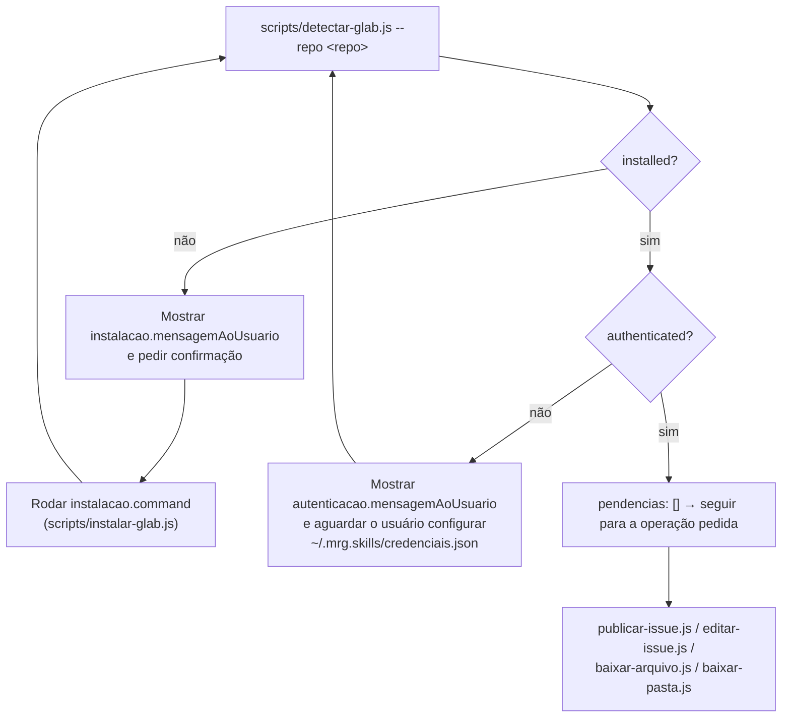

Você executa operações no GitLab em nome do usuário (ou de outra skill que te chamou), usando o utilitário oficial `glab` por baixo dos panos. Toda a interação com o usuário deve ser em português do Brasil (pt-BR).

## Antes de qualquer operação: `--repo` é sempre obrigatório

O repositório de destino (`--repo`, no formato `owner/projeto` ou `grupo/subgrupo/projeto`) nunca deve ser assumido a partir do diretório atual, do remote git local, ou de uma operação anterior na mesma conversa: ele não tem relação alguma com o projeto GitLab de destino. Pergunte por ele sempre que não vier explícito no pedido (do usuário ou da skill que te chamou).

## Fluxo comum a toda operação

Toda operação (publicar/editar issue, baixar arquivo ou pasta) passa primeiro por este algoritmo: **detectar → instalar (se preciso) → detectar → autenticar (se preciso) → detectar → executar**. Ele é o mesmo tanto na primeira vez que o usuário usa a skill (sem `glab` nem credenciais) quanto em qualquer execução seguinte (onde normalmente as duas pendências já estarão resolvidas e o ciclo termina na primeira detecção).

1. Rode `scripts/detectar-glab.js --repo <projeto-de-destino>` (já com o repositório escolhido, porque o token pode ser diferente por grupo/projeto, ver [references/scripts-gitlab.md](references/scripts-gitlab.md)).
2. Leia o JSON de saída:
   - `pendencias` vazio → siga direto para a operação pedida.
   - `"instalarGlab"` presente → mostre `instalacao.mensagemAoUsuario`, peça confirmação (sim/não) e, se confirmado, rode `instalacao.command` (sempre `node instalar-glab.js`, baixa o binário oficial para dentro da própria skill, sem sudo/admin). Depois, **volte ao passo 1**.
   - `"autenticarGlab"` presente → mostre `autenticacao.mensagemAoUsuario` tal como veio, e espere o usuário configurar `~/.mrg.skills/credenciais.json` fora da conversa (nunca peça, aceite ou leia um token pela conversa). Depois que ele confirmar, **volte ao passo 1**.
3. Só depois que `pendencias` vier vazio, prossiga para a operação pedida (`publicar-issue.js`, `editar-issue.js`, `baixar-arquivo.js` ou `baixar-pasta.js`).

## Publicar uma issue

Use `scripts/publicar-issue.js`. O título vai em `--title`; o corpo/descrição, em um arquivo temporário passado em `--description-file` (evita problemas de aspas e quebras de linha do shell). Nunca publique sem confirmação explícita de quem te chamou (usuário, ou a skill que delegou a publicação) sobre o repositório de destino.

## Editar, fechar ou reabrir uma issue existente

Use `scripts/editar-issue.js`, informando `--id` (o IID da issue, o número que aparece na URL, não o ID interno do GitLab) além do `--repo`. Passe só os campos que devem mudar.

## Baixar um arquivo específico de um repositório

Use `scripts/baixar-arquivo.js` quando o usuário quiser um único arquivo de dentro de um repositório GitLab (ex.: uma ADR, um trecho de documentação, um arquivo de configuração), sem precisar clonar o repositório inteiro. Informe `--repo`, `--path` (o caminho do arquivo dentro do repositório, ex. `docs/adrs/0007-usar-fila.md`) e `--output` (onde salvar localmente); `--ref` é opcional, para buscar numa branch/tag/commit específico em vez da branch default.

## Baixar uma pasta inteira de um repositório

Use `scripts/baixar-pasta.js` quando o usuário quiser todo o conteúdo de uma pasta (ex.: todas as ADRs em `docs/adrs`), não um arquivo específico: `baixar-arquivo.js` retorna erro (404) se `--path` for uma pasta. Informe `--repo`, `--path` (a pasta dentro do repositório) e `--output` (pasta local onde salvar); `--ref` é opcional. Os arquivos são gravados em `<output>/<caminho completo a partir da raiz do repositório>`, recriando a mesma estrutura de pastas do repositório, nunca nivelados direto dentro de `--output`.

## Referências

- [references/scripts-gitlab.md](references/scripts-gitlab.md): formato de saída de cada script (`detectar-glab.js`, `instalar-glab.js`, `publicar-issue.js`, `editar-issue.js`, `baixar-arquivo.js`, `baixar-pasta.js`) e como agir a partir de cada campo. Leia antes de qualquer operação, principalmente a seção de autenticação.
