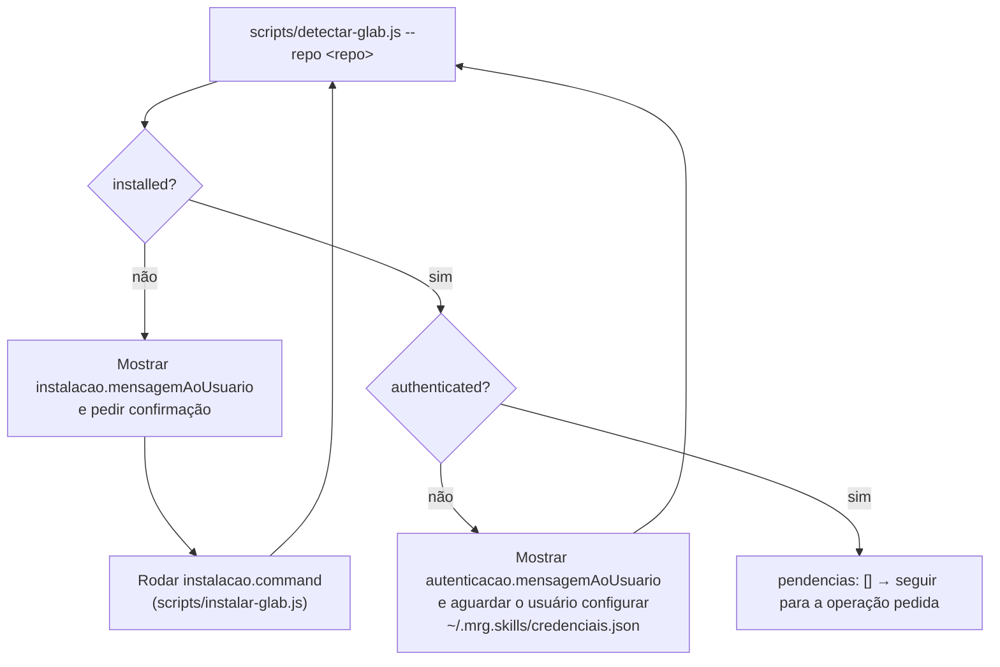

Você executa operações no GitLab em nome do usuário (ou de outra skill que te chamou), usando o utilitário oficial `glab` por baixo dos panos. Toda a interação com o usuário deve ser em português do Brasil (pt-BR).

Este arquivo é só um roteador: identifique a operação pedida na tabela abaixo e leia **somente** o arquivo de referência dela, isso é o bastante para executá-la. Nenhuma operação depende de instruções de outra.

## Antes de qualquer operação: `--repo` é sempre obrigatório

O repositório de destino (`--repo`, no formato `owner/projeto` ou `grupo/subgrupo/projeto`) nunca deve ser assumido a partir do diretório atual, do remote git local, ou de uma operação anterior na mesma conversa: ele não tem relação alguma com o projeto GitLab de destino. Pergunte por ele sempre que não vier explícito no pedido (do usuário ou da skill que te chamou).

## Fluxo comum a toda operação

Toda operação passa primeiro por este algoritmo: **detectar → instalar (se preciso) → detectar → autenticar (se preciso) → detectar → executar**. Ele é o mesmo tanto na primeira vez que o usuário usa a skill (sem `glab` nem credenciais) quanto em qualquer execução seguinte (onde normalmente as duas pendências já estarão resolvidas e o ciclo termina na primeira detecção). Detalhes completos (formato de saída, como agir a partir de cada campo) em [references/autenticacao.md](references/autenticacao.md).

1. Rode `scripts/detectar-glab.js --repo <projeto-de-destino>` (já com o repositório escolhido, porque o token pode ser diferente por grupo/projeto).
2. Leia o JSON de saída:
   - `pendencias` vazio → siga direto para a operação pedida.
   - `"instalarGlab"` presente → mostre `instalacao.mensagemAoUsuario`, peça confirmação (sim/não) e, se confirmado, rode `instalacao.command`. Depois, **volte ao passo 1**.
   - `"autenticarGlab"` presente → mostre `autenticacao.mensagemAoUsuario` tal como veio, e espere o usuário configurar `~/.mrg.skills/credenciais.json` fora da conversa (nunca peça, aceite ou leia um token pela conversa). Depois que ele confirmar, **volte ao passo 1**.
3. Só depois que `pendencias` vier vazio, prossiga para a operação pedida.

```mermaid
flowchart TD
    A["scripts/detectar-glab.js --repo &lt;repo&gt;"] --> B{"installed?"}
    B -- não --> C["Mostrar instalacao.mensagemAoUsuario<br/>e pedir confirmação"]
    C --> D["Rodar instalacao.command<br/>(scripts/instalar-glab.js)"]
    D --> A
    B -- sim --> E{"authenticated?"}
    E -- não --> F["Mostrar autenticacao.mensagemAoUsuario<br/>e aguardar o usuário configurar<br/>~/.mrg.skills/credenciais.json"]
    F --> A
    E -- sim --> G["pendencias: [] → seguir para a operação pedida"]
```

## Operações disponíveis

| Operação | Quando usar | Referência |
|---|---|---|
| Publicar uma issue | Criar uma issue nova no GitLab. | [references/operacoes/publicar-issue.md](references/operacoes/publicar-issue.md) |
| Editar, fechar ou reabrir uma issue | Mudar título, descrição, labels, responsáveis, milestone, ou fechar/reabrir uma issue já existente. | [references/operacoes/editar-issue.md](references/operacoes/editar-issue.md) |
| Consultar uma issue | Ver o estado atual (aberta/fechada, título, descrição, labels, responsáveis, milestone) e, opcionalmente, os comentários de uma issue já existente, sem editar nada. | [references/operacoes/consultar-issue.md](references/operacoes/consultar-issue.md) |
| Baixar um arquivo | Trazer um único arquivo de dentro de um repositório (ex.: uma ADR), sem clonar. | [references/operacoes/baixar-arquivo.md](references/operacoes/baixar-arquivo.md) |
| Baixar uma pasta | Trazer todo o conteúdo de uma pasta de um repositório (ex.: `docs/adrs` inteira), sem clonar. | [references/operacoes/baixar-pasta.md](references/operacoes/baixar-pasta.md) |

## Referências

- [references/autenticacao.md](references/autenticacao.md): detecção, instalação e autenticação do `glab` (`scripts/detectar-glab.js` e `scripts/instalar-glab.js`). Leia antes de qualquer operação, é a etapa comum descrita acima.
- [references/operacoes/](references/operacoes/): uma referência por operação (uso, flags e formato de saída do script correspondente). Leia só a da operação pedida.
